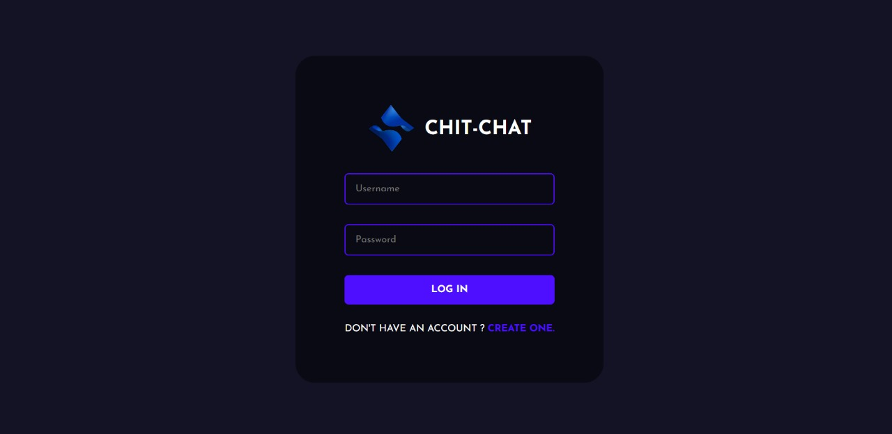

# Chit-Chat - Chat Application 
Chit-Chat is a chat application built with the power of the MERN Stack.


### Login Page


### Home Page


### Avatar Selection Page


### Chat Page


---

## Installation Guide

### Requirements

- [Node.js](https://nodejs.org/en/download)
- [MongoDB](https://www.mongodb.com/docs/manual/administration/install-community/)

Make sure both are installed and that MongoDB is running.

### Installation

1. Clone the repository:

    ```bash
    git clone https://github.com/YourUsername/chatapp.git
    cd chat-app-react-nodejs
    ```

2. Rename the environment files from `.env.example` to `.env`:

    ```bash
    # Rename in the public folder
    cd public
    mv .env.example .env
    cd ..

    # Rename in the server folder
    cd server
    mv .env.example .env
    cd ..
    ```

3. Install dependencies for both the frontend and backend:

    - **Backend**:

      ```bash
      cd server
      yarn
      cd ..
      ```

    - **Frontend**:

      ```bash
      cd public
      yarn
      cd ..
      ```

4. Start the development server:

    - **Frontend**:

      ```bash
      cd public
      yarn start
      ```

    - **Backend** (in a new terminal window):

      Ensure MongoDB is running in the background:

      ```bash
      cd server
      yarn start
      ```

5. Once both servers are running, open [http://localhost:3000](http://localhost:3000) in your browser to view the app.

---

## Tech Stack

- **Frontend**: React.js
- **Backend**: Node.js, Express.js
- **Database**: MongoDB
- **Real-time Communication**: Socket.io
- **Styling**: Styled-components

---

## Features

- **Real-time Messaging**: Instant communication powered by Socket.io.
- **Avatar Selection**: Customize your profile by selecting an avatar.
- **User Authentication**: Secure login and registration with encrypted passwords.

---

